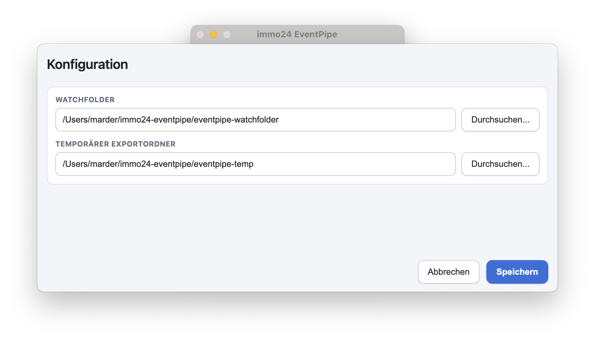
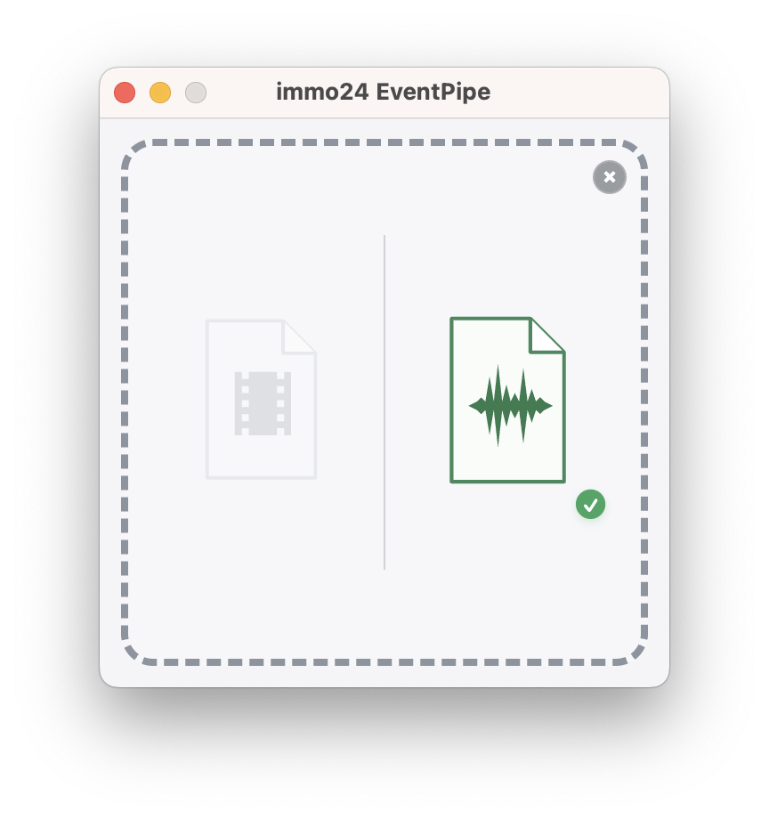
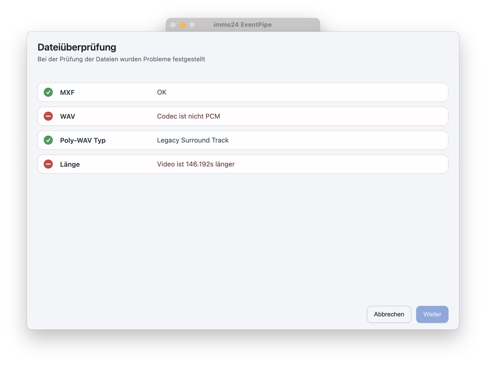
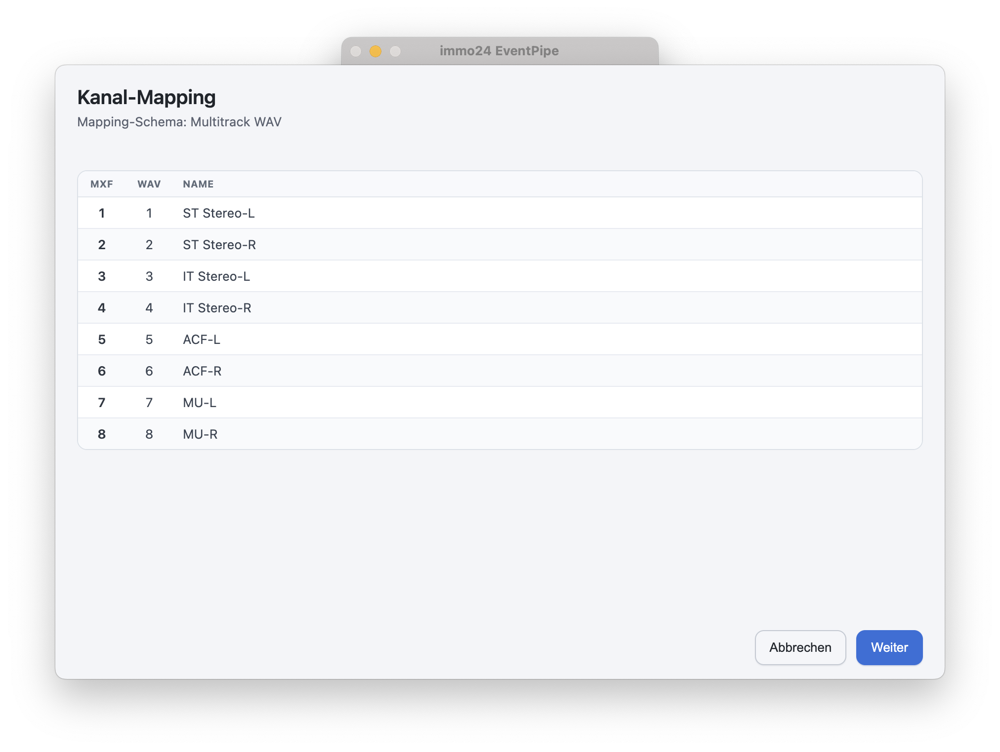
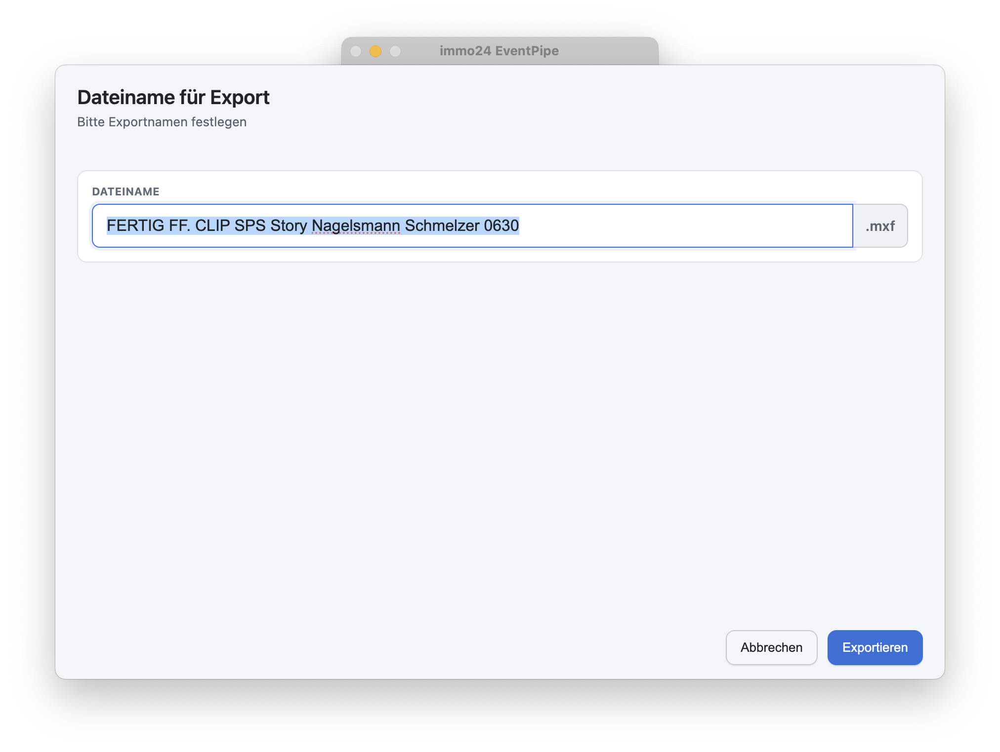

# immo24 EventPipe

Die **immo24 EventPipe** muxt ein Video-File mit einem PolyWAV nach verschiedenen Mapping-Standards in ein MXF und exportiert es anschließend in ein benutzerdefiniertes Verzeichnis.

---

## 🚀 Features

- Muxen eines MXF Videofiles und einer Poly-WAV Datei (ffmpeg)
- sauberes Mapping von sowohl Stereo / Quad / 5.1 / 7.1 Pro Tools-Files, als auch Poly-WAVs ohne Channel-Layout
- Ausgabe des anzuwendenen Mappings
- Zwischenspeicherung in Temp-Verzeichnis
- nachvollziehbarer File-Check auf Länge und Audio-Codec (ffprobe)
- intuitive Drag&Drop-Bedienung
- Log-Ausgabe
- Cross-Plattform (macOS & Windows)

---

## ⚙️ Konfiguration

Beim ersten Start erscheint das **Konfigurationsmenü**.

Es lässt sich später auch öffnen über:
**Menüleiste → immo24 Studioassistent → Konfiguration**  
oder per Tastenkürzel: **CMD+,** (macOS) / **STRG+,** (Windows).  

### Watchfolder
Verzeichnis, wohin das fertige Videofile final exportiert wird.

### Temporärer Exportordner
Verzeichnis, in dem das wachsende Videofile temporär zwischengespeichert wird.
Hier werden auch alle Logs abgelegt.

---

## 📂 Verwendung

### Dropzone
Beim Start erscheint das **Dropzone-Fenster**.
Auf dieses Fenster werden sowohl das Video- als auch das Audiofile per Drag&Drop gezogen.

Sobald ein gültiges File abgelegt wurde, erscheint ein grüner Haken zur Bestätigung am jeweiligen Dateitypen.

Sobald beide Files abgelegt wurden, startet der Export-Workflow.

Es können auch beide Files gleichzeitig auf der Dropzone abgelegt werden.

Mit X kann die Dropzone wieder geleert werden.

### Dateiüberprüfung
Wenn zwei passende Files in der Dropzone abgelegt wurden, erfolgt eine kurze Prüfung auf Audio-Codec, Spur-Mapping und Länge der beiden Files.

Sollten beide Files zusammen passen, wird das Ergebnis der Überprüfung übersprungen.

### Kanal-Mapping
immo24 EventPipe kann sowohl mit Bounce-To-Disk / Sounddevices Poly-WAVs, als auch mit Pro Tools Surround-Tracks umgehen.

Wird ein Standard Poly-WAV erkannt, bleibt das Mapping 1:1. Das Mapping wird zur Kontrolle angezeigt mit allen verfügbaren Metadaten.

Wird ein Pro Tools Surround-Track erkannt, wechselt das Mapping von Film- auf SMPTE Norm.

### Export
Zuletzt muss ein passender File-Name vergeben werden.

Anschließend startet immo24 EventPipe den Export-Vorgang. Bei abgeschlossenem Vorgang wird die Datei aus dem Temp- in den angegebenen Watchfolder kopiert.

Ein entsprechendes FFMPEG-Log lässt sich aufrufen.

---

## 🛡️ Lizenz

Die **immo24 EventPipe** steht unter der  
[GNU Affero General Public License v3.0 (AGPL-3.0)](./LICENSE).  

- Frei nutzbar unter AGPL-Bedingungen  
- Änderungen und Forks müssen ebenfalls unter AGPL veröffentlicht werden  
- Betrieb als Service löst ebenfalls Offenlegungspflicht aus  

👉 Drittanbieter-Lizenzen: siehe [LICENSES/](./LICENSES)  

---